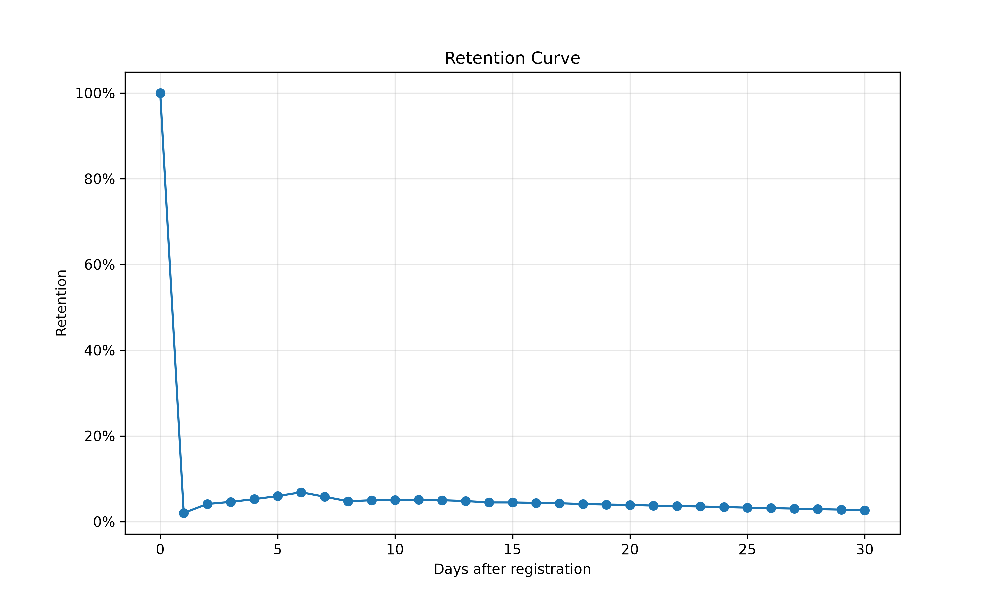

# 🎮 Mobile Game Analytics Project



## 📌 Project Overview

This project explores user behavior in a mobile game using SQL and Python.

The analysis follows a complete product analytics workflow, including data quality assessment, user activity analysis, retention analysis, A/B test evaluation, and data visualization.

The objective of the project is to understand user engagement, identify retention patterns, and evaluate monetization performance through product metrics.

---

# 📂 Dataset

**Source:**
Gamelytics: Mobile Analytics Challenge (Kaggle)

https://www.kaggle.com/datasets/debs2x/gamelytics-mobile-analytics-challenge

The project uses three datasets.

### reg_data

Contains user registration events.

Columns:

* `uid`
* `reg_ts`

### auth_data

Contains user authentication (login) events.

Columns:

* `uid`
* `auth_ts`

### ab_test

Contains A/B experiment results.

Columns:

* `user_id`
* `testgroup`
* `revenue`

---

# 🛠 Tools

* PostgreSQL
* SQL
* Python
* Pandas
* Matplotlib
* Git
* GitHub
* ChatGPT

---

## 🤖 AI Assistance

This project was completed independently with AI assistance.

ChatGPT was used as a learning companion for:
- discussing SQL solutions;
- reviewing code and analytical reasoning;
- improving documentation and project structure;
- refining the README and presentation of results.

All SQL queries, Python code, analysis, and final conclusions were reviewed, understood, and adapted by the author.

---

# 📂 Repository Structure

```text
mobile-game-analytics/
│
├── README.md
│
├── data/
│   ├── reg_data.csv
│   ├── auth_data.csv
│   └── ab_test.csv
│
├── sql/
│   ├── 01_data_quality/
│   ├── 02_user_activity/
│   ├── 03_retention/
│   └── 04_ab_test/
│
├── python/
│   └── retention_curve.py
│
└── images/
    └── retention_curve.png
```

---

# 🔄 Project Workflow

## 1. Data Quality Assessment

Before starting the analysis, the datasets were validated to ensure data consistency and completeness.

Performed checks included:

* duplicate registrations;
* missing values;
* registration period;
* consistency between registration and authentication tables;
* validation of A/B experiment data.

SQL scripts:

`sql/01_data_quality/`

---

## 2. User Activity Analysis

User engagement was explored using activity metrics.

Calculated metrics:

* average number of logins per user;
* Daily Active Users (DAU);
* Weekly Active Users (WAU);
* Monthly Active Users (MAU);
* distribution of users by activity level.

SQL scripts:

`sql/02_user_activity/`

---

## 3. Retention Analysis

Retention was calculated using registration and authentication events.

Calculated metrics:

* Days After Registration;
* Day-N Retention;
* Cohort Retention.

A retention curve was built and visualized using Python.

SQL scripts:

`sql/03_retention/`

Python visualization:

`python/retention_curve.py`

Output:

`images/retention_curve.png`

---

## 4. A/B Test Analysis

The experiment groups were compared using monetization metrics.

Calculated metrics:

* total revenue;
* number of paying users;
* ARPU;
* ARPPU.

SQL scripts:

`sql/04_ab_test/`

---

# 📈 Key Findings

## 👥 User Activity

* All three datasets passed data quality checks: no missing values or duplicate records were detected.
* Every authentication event corresponds to an existing registered user, ensuring consistency between registration and authentication data.
* Users logged into the game **9.6 times on average** during the observation period.
* More than half of the users logged in only **1–10 times**, while only a small share demonstrated long-term engagement.
* Daily Active Users (DAU) varied substantially throughout the observation period, indicating noticeable fluctuations in user activity.

---

## 📉 Retention

* The retention curve shows a sharp decline immediately after registration.
* The largest drop occurs during the first few days, suggesting that many users do not continue using the product after their initial experience.
* A slight increase in retention is observed around days 6–7, followed by a gradual stabilization at a low level.
* Although retention never reaches zero, only a small proportion of users remain active over the long term.

---

## 💰 A/B Test

* Revenue, ARPU, ARPPU, and the number of paying users were compared between the two experimental groups.
* Group B demonstrated higher monetization metrics than Group A.
* The analysis indicates measurable differences between the experiment groups, providing a basis for further statistical evaluation.

---

# 💡 Product Insights

The analysis suggests that the primary challenge is not attracting users but retaining them after registration.

The combination of low long-term activity and the retention curve indicates that many users do not reach the product's core value during their first sessions. This may point to friction in the onboarding experience or insufficient early engagement.

The existence of a smaller group of highly active users suggests that the product is capable of delivering value once users successfully adopt it. Therefore, improving early user activation could increase the proportion of long-term retained users.

---

# 🚀 Recommendations

Possible next steps include:

* investigate the onboarding experience and identify where users disengage;
* analyze user behavior during the first sessions;
* evaluate tutorial completion and other early activation metrics;
* segment users by activity level to better understand differences in long-term engagement;
* perform statistical significance testing for the A/B experiment before making product decisions.

---

# 📚 Skills & Techniques Used

### SQL

* Common Table Expressions (CTE)
* JOINs
* Window Functions
* Aggregate Functions
* Date and Time Functions
* Cohort Analysis
* Data Validation

### Product Analytics

* Data Quality Assessment
* User Activity Analysis
* Retention Analysis
* Cohort Analysis
* A/B Test Analysis
* KPI Calculation (DAU, WAU, MAU, ARPU, ARPPU)
* Product Metrics Interpretation

### Python

* pandas
* matplotlib
* Data Visualization

---

# 📌 Future Improvements

Possible extensions of the project include:

* statistical significance testing for the A/B experiment;
* retention heatmap visualization;
* user segmentation by engagement level;
* conversion funnel analysis;
* dashboard development using Tableau or Power BI.
